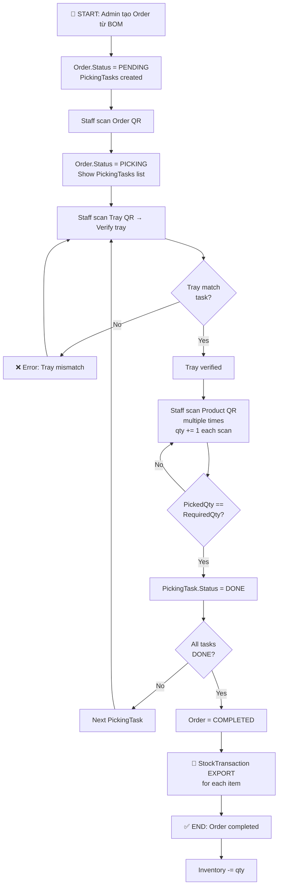
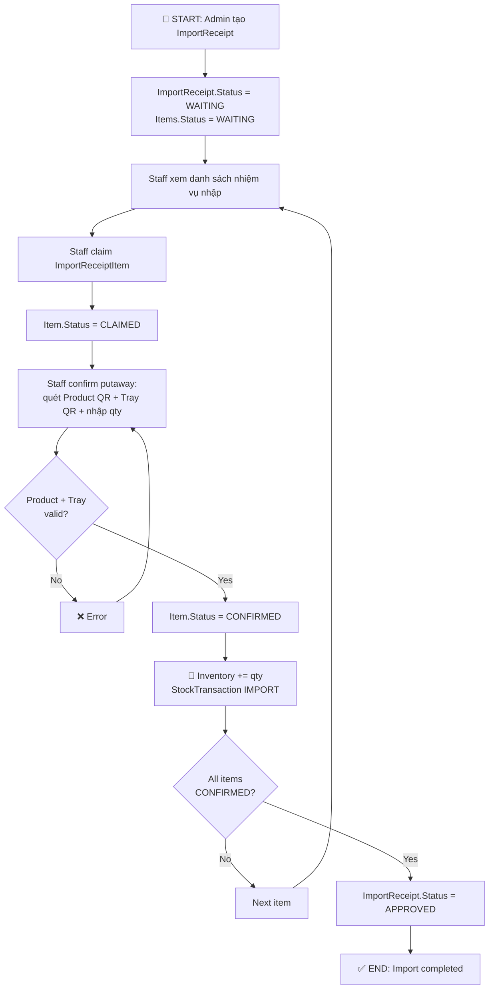
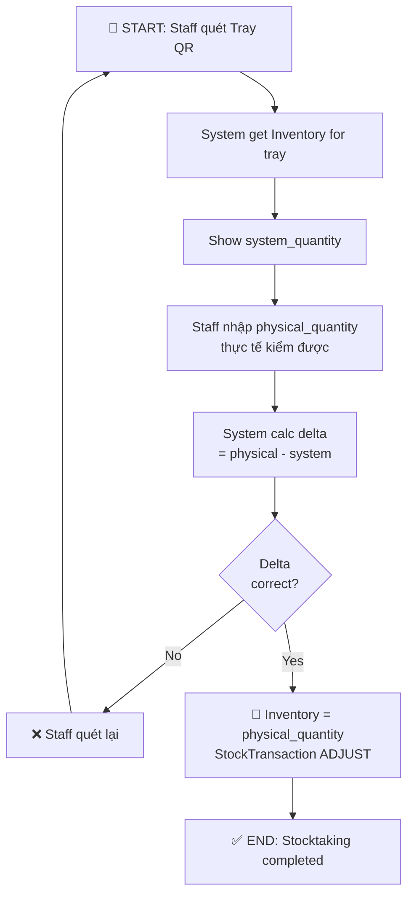
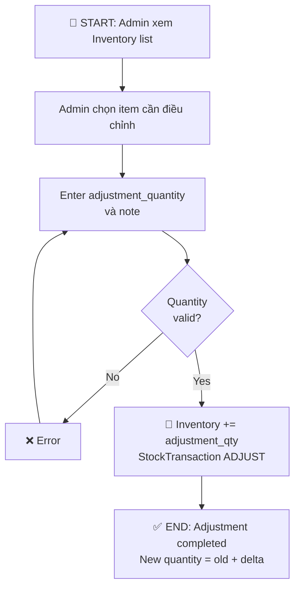
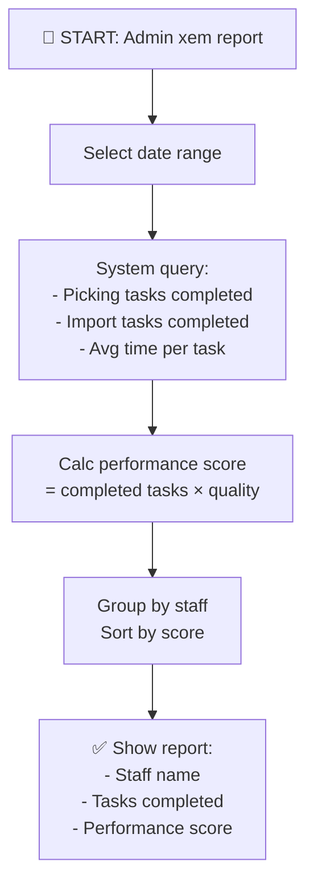
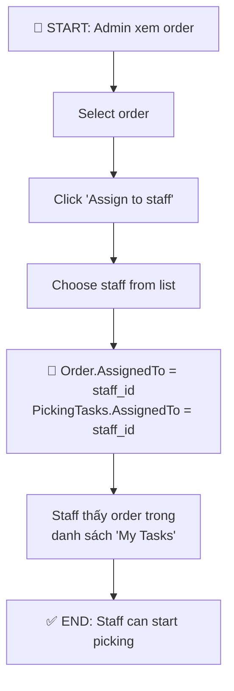
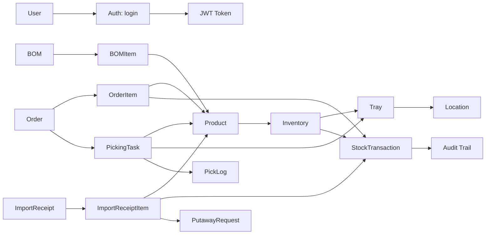

# 📦 WMS (Warehouse Management System) - API & BUSINESS FLOW DOCUMENTATION

---

## 📋 MỤC LỤC
1. [API Context - Toàn bộ Endpoints](#1-api-context)
2. [JWT & Authentication](#2-jwt--authentication)
3. [Interceptor & Error Handling](#3-interceptor--error-handling)
4. [Role-Based Access Control](#4-role-based-access-control)
5. [Business Flows & Diagrams](#5-business-flows--diagrams)
6. [Error Code Reference](#6-error-code-reference)

---

# 1. API CONTEXT - TOÀN BỘ ENDPOINTS

## 1.1 API Base URL
```
Backend: http://localhost:8080/api/v1
```

---

## 1.2 AUTH ENDPOINTS

### Login
```
POST /auth/login
No Auth Required

Request Body:
{
  "username": "admin",
  "password": "password123"
}

Response 200 OK:
{
  "access_token": "eyJhbGciOiJIUzI1NiIsInR5cCI6IkpXVCJ9...",
  "token_type": "Bearer",
  "user": {
    "id": 1,
    "username": "admin",
    "full_name": "Admin User",
    "role": "ADMIN"
  }
}

Response 401 Unauthorized:
{
  "error": "Invalid credentials"
}

Response 422 Unprocessable Entity:
{
  "error": "Username and password are required"
}
```

### Get Current User
```
GET /auth/me
Auth Required: Bearer Token

Response 200 OK:
{
  "user": {
    "id": 1,
    "username": "admin",
    "role": "ADMIN"
  }
}

Response 401 Unauthorized:
{
  "error": "Unauthorized"
}
```

---

## 1.3 PRODUCT ENDPOINTS

| Endpoint | Method | Auth | Role | Description |
|----------|--------|------|------|-------------|
| `/products` | GET | ✅ | Any | Danh sách tất cả sản phẩm (có phân trang) |
| `/products/code-preview` | GET | ✅ | Any | Gợi ý mã sản phẩm (autocomplete) |
| `/products/scan/:qr_code` | GET | ✅ | Any | Quét QR code sản phẩm → trả product detail |
| `/products/:id` | GET | ✅ | Any | Chi tiết một sản phẩm |
| `/products` | POST | ✅ | ADMIN | Tạo sản phẩm mới |
| `/products/:id` | PUT | ✅ | ADMIN | Cập nhật sản phẩm |
| `/products/:id` | DELETE | ✅ | ADMIN | Xóa sản phẩm |

**Product Model:**
```json
{
  "id": 1,
  "product_code": "SKU001",
  "qr_code": "SKU001_QR",
  "product_name": "Điều khiển từ xa",
  "product_type": "COMPONENT",  // COMPONENT | FINISHED_GOOD
  "image_url": "https://...",
  "description": "Điều khiển từ xa hồng ngoại",
  "unit": "Cái",
  "min_stock": 50,
  "price": 250000,
  "is_active": true,
  "created_at": "2024-01-01T10:00:00Z"
}
```

---

## 1.4 INVENTORY ENDPOINTS

### Get Inventory List
```
GET /inventory?product_id=1&page=1&limit=20
Auth Required: Bearer Token
Role Required: ADMIN | WAREHOUSE

Response 200 OK:
{
  "data": [
    {
      "id": 1,
      "product_id": 1,
      "product": { "id": 1, "product_name": "...", "product_code": "..." },
      "tray_id": 5,
      "tray": { "id": 5, "tray_code": "TRAY001", "location": {...} },
      "quantity": 100,
      "created_at": "2024-01-01T10:00:00Z",
      "updated_at": "2024-01-01T10:00:00Z"
    }
  ],
  "pagination": { "page": 1, "limit": 20, "total": 150 }
}
```

### Create Initial Inventory
```
POST /inventory
Auth Required: Bearer Token
Role Required: ADMIN

Request Body:
{
  "product_id": 1,
  "tray_id": 5,
  "quantity": 100
}

Response 201 Created:
{ "id": 1, "product_id": 1, "tray_id": 5, "quantity": 100 }

Response 409 Conflict:
{ "error": "Inventory for this product-tray combination already exists" }
```

### Manual Inventory Adjustment
```
PATCH /inventory/:id/adjust
Auth Required: Bearer Token
Role Required: ADMIN

Request Body:
{
  "adjustment_quantity": 10,  // Positive or negative
  "note": "Manual correction"
}

Response 200 OK:
{
  "id": 1,
  "product_id": 1,
  "quantity": 110,
  "updated_at": "2024-01-01T11:00:00Z"
}
```

### Putaway (Nhập kho) - Scan Product + Tray
```
POST /inventory/putaway
Auth Required: Bearer Token
Role Required: ADMIN | WAREHOUSE

Request Body:
{
  "product_qr_code": "SKU001_QR",  // Quét QR sản phẩm
  "tray_qr_code": "TRAY001_QR",     // Quét QR khay
  "quantity": 5                       // Nhập số lượng
}

Response 200 OK:
{
  "success": true,
  "inventory_id": 1,
  "new_quantity": 105
}

Response 404 Not Found:
{ "error": "Product or Tray not found" }

Response 422 Unprocessable Entity:
{ "error": "Product and Tray are not linked" }

Tự động ghi StockTransaction:
{
  "transaction_type": "IMPORT",
  "product_id": 1,
  "tray_id": 5,
  "quantity": 5,
  "before_quantity": 100,
  "after_quantity": 105,
  "created_by": 1,
  "created_at": "2024-01-01T11:00:00Z"
}
```

### Stock Taking (Kiểm kê) - Quét Tray + Nhập Qty Thực Tế
```
POST /inventory/stocktaking
Auth Required: Bearer Token
Role Required: ADMIN | WAREHOUSE

Request Body:
{
  "tray_qr_code": "TRAY001_QR",    // Quét QR khay
  "physical_quantity": 95           // Qty thực tế kiểm được
}

Response 200 OK:
{
  "tray_id": 5,
  "system_quantity": 100,
  "physical_quantity": 95,
  "delta": -5,
  "transaction_id": 10
}

Tự động ghi StockTransaction (ADJUST):
{
  "transaction_type": "ADJUST",
  "quantity": -5,
  "before_quantity": 100,
  "after_quantity": 95,
  "note": "Stocktaking"
}
```

---

## 1.5 ORDER ENDPOINTS (PICKING - XUẤT KHO)

### Create Order from BOM
```
POST /orders
Auth Required: Bearer Token
Role Required: ADMIN

Request Body:
{
  "bom_id": 1,
  "customer_name": "Công ty ABC",
  "customer_phone": "0912345678",
  "customer_address": "123 Đường XYZ"
}

Response 201 Created:
{
  "id": 1,
  "order_code": "ORD001",
  "qr_code": "ORD001_QR",
  "customer_name": "Công ty ABC",
  "status": "PENDING",
  "items": [
    {
      "product_id": 1,
      "product_name": "Điều khiển",
      "quantity": 10
    }
  ],
  "total_amount": 2500000,
  "created_by": 1,
  "created_at": "2024-01-01T10:00:00Z"
}
```

### Scan Order QR to Start Picking
```
GET /orders/scan/:qr_code
Auth Required: Bearer Token
Role Required: ADMIN | WAREHOUSE

Response 200 OK:
{
  "order_id": 1,
  "order_code": "ORD001",
  "customer_name": "Công ty ABC",
  "status": "PENDING",
  "picking_tasks": [
    {
      "id": 1,
      "product_id": 1,
      "product_name": "Điều khiển",
      "tray_id": 5,
      "required_quantity": 10,
      "picked_quantity": 0,
      "status": "WAITING"
    }
  ]
}

Tự động: Order.Status = PICKING, PickingTasks được tạo
```

### Verify Tray before Picking
```
POST /orders/picking-tasks/:id/verify-tray
Auth Required: Bearer Token
Role Required: ADMIN | WAREHOUSE

Request Body:
{
  "tray_qr_code": "TRAY001_QR"  // Verify tray khớp với picking task
}

Response 200 OK:
{
  "picking_task_id": 1,
  "verified": true,
  "tray_code": "TRAY001"
}

Response 422 Unprocessable Entity:
{ "error": "Tray QR code does not match picking task" }
```

### Scan Product for Picking
```
POST /orders/picking-tasks/:id/scan-product
Auth Required: Bearer Token
Role Required: ADMIN | WAREHOUSE

Request Body:
{
  "product_qr_code": "SKU001_QR"  // Quét QR sản phẩm lần thứ N
}

Response 200 OK:
{
  "picking_task_id": 1,
  "product_id": 1,
  "required_quantity": 10,
  "picked_quantity": 5,  // Tăng 1 (qty=1 mỗi scan)
  "status": "PICKING"
}

Response 422 Unprocessable Entity:
{ "error": "Product QR does not match picking task" }

Response 409 Conflict:
{ "error": "Picking task already completed" }

Khi picked_quantity == required_quantity:
  PickingTask.Status = DONE
```

### Get Picking Tasks for Order
```
GET /orders/:id/picking-tasks
Auth Required: Bearer Token

Response 200 OK:
[
  {
    "id": 1,
    "product_id": 1,
    "product": { "product_code": "SKU001", "product_name": "..." },
    "tray_id": 5,
    "required_quantity": 10,
    "picked_quantity": 8,
    "status": "PICKING",
    "verified": true
  }
]
```

### Finish Order
```
POST /orders/:id/finish
Auth Required: Bearer Token
Role Required: ADMIN | WAREHOUSE

Response 200 OK:
{
  "order_id": 1,
  "status": "COMPLETED",
  "completed_at": "2024-01-01T14:00:00Z"
}

Điều kiện: Tất cả PickingTasks must have status = DONE

Tự động ghi StockTransaction (EXPORT) cho mỗi item:
{
  "transaction_type": "EXPORT",
  "product_id": 1,
  "tray_id": 5,
  "quantity": 10,
  "reference_code": "ORD001"
}
```

### Assign Order to Staff
```
PATCH /admin/picking/orders/:order_id/assign
Auth Required: Bearer Token
Role Required: ADMIN

Request Body:
{
  "user_id": 5  // Staff ID (role WAREHOUSE)
}

Response 200 OK:
{
  "order_id": 1,
  "assigned_to": 5,
  "assigned_at": "2024-01-01T10:00:00Z"
}

Các PickingTasks sẽ được link với staff này
```

---

## 1.6 IMPORT RECEIPT ENDPOINTS

### Create Import Receipt
```
POST /import-receipts
Auth Required: Bearer Token
Role Required: ADMIN

Request Body:
{
  "supplier_name": "Nhà cung cấp ABC",
  "items": [
    {
      "product_id": 1,
      "quantity": 50
    }
  ],
  "note": "Lô hàng tháng 1"
}

Response 201 Created:
{
  "id": 1,
  "receipt_code": "IMP001",
  "supplier_name": "Nhà cung cấp ABC",
  "status": "WAITING",
  "items": [
    {
      "id": 1,
      "product_id": 1,
      "quantity": 50,
      "status": "WAITING"
    }
  ]
}
```

### Get Import Receipt Items for Staff
```
GET /staff/import-receipt-items
Auth Required: Bearer Token
Role Required: ADMIN | WAREHOUSE

Response 200 OK:
[
  {
    "id": 1,
    "receipt_code": "IMP001",
    "product": { "product_code": "SKU001", "product_name": "..." },
    "quantity": 50,
    "status": "WAITING",
    "assigned_to": null
  }
]
```

### Claim Import Task
```
POST /staff/import-receipt-items/:item_id/claim
Auth Required: Bearer Token
Role Required: ADMIN | WAREHOUSE

Response 200 OK:
{
  "item_id": 1,
  "status": "CLAIMED",
  "claimed_by": 5,
  "claimed_at": "2024-01-01T10:00:00Z"
}

ImportReceiptItem.Status = CLAIMED
ImportReceiptItem.AssignedTo = current_user_id
```

### Confirm Import (Putaway)
```
POST /staff/import-receipt-items/:item_id/confirm
Auth Required: Bearer Token
Role Required: ADMIN | WAREHOUSE

Request Body:
{
  "product_qr_code": "SKU001_QR",
  "tray_qr_code": "TRAY001_QR",
  "quantity": 50
}

Response 200 OK:
{
  "item_id": 1,
  "status": "CONFIRMED",
  "inventory_id": 5,
  "new_quantity": 150
}

Tự động:
  - ImportReceiptItem.Status = CONFIRMED
  - Inventory += quantity
  - StockTransaction (IMPORT) được ghi
  - Nếu tất cả items confirmed → ImportReceipt.Status = APPROVED
```

### Get Staff Import Summary
```
GET /staff/import-receipt-items/summary
Auth Required: Bearer Token

Response 200 OK:
{
  "waiting": 5,
  "claiming": 2,
  "claimed": 1,
  "confirmed": 15
}
```

---

## 1.7 BOM ENDPOINTS

### Create BOM
```
POST /boms
Auth Required: Bearer Token
Role Required: ADMIN | WAREHOUSE

Request Body:
{
  "product_id": 2,  // Sản phẩm cha (finished good)
  "bom_name": "BOM_FG001",
  "description": "BOM cho sản phẩm hoàn thành",
  "items": [
    {
      "component_product_id": 1,
      "quantity": 2
    },
    {
      "component_product_id": 3,
      "quantity": 5
    }
  ]
}

Response 201 Created:
{
  "id": 1,
  "product_id": 2,
  "bom_name": "BOM_FG001",
  "items": [
    { "id": 1, "component_product_id": 1, "quantity": 2 },
    { "id": 2, "component_product_id": 3, "quantity": 5 }
  ]
}
```

### Get BOM Items
```
GET /boms/:id/items
Auth Required: Bearer Token

Response 200 OK:
[
  {
    "id": 1,
    "bom_id": 1,
    "component_product_id": 1,
    "component_product": { "product_code": "SKU001", "product_name": "..." },
    "quantity": 2
  }
]
```

---

## 1.8 LOCATION & TRAY ENDPOINTS

### Get Locations
```
GET /locations
Auth Required: Bearer Token

Response 200 OK:
[
  {
    "id": 1,
    "location_code": "LOC_A1",
    "location_name": "Khu vực A tầng 1",
    "description": "Khu vực lưu trữ chính",
    "is_active": true
  }
]
```

### Get Trays in Location
```
GET /locations/:id/trays
Auth Required: Bearer Token

Response 200 OK:
[
  {
    "id": 1,
    "tray_code": "TRAY001",
    "product_id": 1,
    "location_id": 1,
    "qr_code": "TRAY001_QR",
    "is_active": true
  }
]
```

### Scan Tray QR
```
GET /trays/scan/:qr_code
Auth Required: Bearer Token

Response 200 OK:
{
  "id": 1,
  "tray_code": "TRAY001",
  "product_id": 1,
  "location_id": 1,
  "qr_code": "TRAY001_QR",
  "inventory": { "quantity": 100 }
}

Response 404 Not Found:
{ "error": "Tray not found" }
```

---

## 1.9 STAFF ENDPOINTS

### Get Staff Tasks (Picking Tasks)
```
GET /staff/tasks?status=WAITING&page=1&limit=20
Auth Required: Bearer Token
Role Required: ADMIN | WAREHOUSE

Response 200 OK:
{
  "data": [
    {
      "id": 1,
      "order_id": 1,
      "order_code": "ORD001",
      "product": { "product_code": "SKU001", "product_name": "..." },
      "required_quantity": 10,
      "picked_quantity": 0,
      "status": "WAITING"
    }
  ],
  "pagination": { "total": 25 }
}
```

### Get Task Summary
```
GET /staff/task-summary
Auth Required: Bearer Token

Response 200 OK:
{
  "waiting": 5,
  "picking": 2,
  "done": 15
}
```

### Staff Claims Order (để bắt đầu picking)
```
POST /staff/orders/:order_id/claim
Auth Required: Bearer Token
Role Required: ADMIN | WAREHOUSE

Response 200 OK:
{
  "order_id": 1,
  "claimed_by": 5,
  "claimed_at": "2024-01-01T10:00:00Z"
}
```

---

## 1.10 STOCK TRANSACTION & AUDIT ENDPOINTS

### Get Stock Transactions (Audit Trail)
```
GET /stock-transactions?product_id=1&type=IMPORT&page=1
Auth Required: Bearer Token

Response 200 OK:
[
  {
    "id": 1,
    "transaction_type": "IMPORT",
    "product_id": 1,
    "tray_id": 5,
    "quantity": 50,
    "before_quantity": 0,
    "after_quantity": 50,
    "reference_code": "IMP001",
    "note": "Nhập từ nhà cung cấp",
    "created_by": 1,
    "created_at": "2024-01-01T10:00:00Z"
  }
]
```

### Get Pick Logs
```
GET /pick-logs?order_id=1
Auth Required: Bearer Token

Response 200 OK:
[
  {
    "id": 1,
    "transaction_type": "PICKING",
    "order_id": 1,
    "product_id": 1,
    "quantity": 1,
    "created_by": 5,
    "created_at": "2024-01-01T10:05:00Z"
  }
]
```

---

## 1.11 DASHBOARD & REPORTS

### Dashboard Stats
```
GET /dashboard/stats
Auth Required: Bearer Token

Response 200 OK:
{
  "total_inventory_value": 50000000,
  "total_products": 150,
  "total_trays": 200,
  "low_stock_products": 12,
  "pending_orders": 5,
  "active_picking_tasks": 8
}
```

### Staff Performance Report
```
GET /admin/reports/staff-performance?date_from=2024-01-01&date_to=2024-01-31
Auth Required: Bearer Token
Role Required: ADMIN

Response 200 OK:
[
  {
    "user_id": 5,
    "username": "staff001",
    "full_name": "Nguyễn Văn A",
    "picking_tasks_completed": 120,
    "import_tasks_completed": 50,
    "avg_picking_time": 2.5,  // phút
    "performance_score": 95
  }
]
```

---

## 1.12 USER MANAGEMENT

### Get Users
```
GET /users?page=1&limit=20
Auth Required: Bearer Token
Role Required: ADMIN

Response 200 OK:
[
  {
    "id": 1,
    "username": "admin",
    "full_name": "Admin User",
    "role": "ADMIN",
    "is_active": true,
    "created_at": "2024-01-01T00:00:00Z"
  }
]
```

### Create User
```
POST /users
Auth Required: Bearer Token
Role Required: ADMIN

Request Body:
{
  "username": "staff001",
  "password": "securepass123",
  "full_name": "Nguyễn Văn A",
  "role": "WAREHOUSE"  // ADMIN | WAREHOUSE
}

Response 201 Created:
{
  "id": 5,
  "username": "staff001",
  "full_name": "Nguyễn Văn A",
  "role": "WAREHOUSE",
  "is_active": true
}

Response 409 Conflict:
{ "error": "Username already exists" }
```

### Update User Status
```
PATCH /users/:id/status
Auth Required: Bearer Token
Role Required: ADMIN

Request Body:
{
  "is_active": false
}

Response 200 OK:
{ "id": 5, "is_active": false }
```

---

# 2. JWT & AUTHENTICATION

## 2.1 Token Structure

```
Header:
{
  "alg": "HS256",
  "typ": "JWT"
}

Payload:
{
  "user_id": 1,
  "username": "admin",
  "role": "ADMIN",
  "iat": 1704096000,           // Issued At
  "exp": 1704182400,           // Expires At (24 hours later)
  "iss": "wms-system"
}

Signature:
HMACSHA256(
  base64UrlEncode(header) + "." +
  base64UrlEncode(payload),
  secret
)
```

## 2.2 JWT Configuration

```env
JWT_SECRET=your-super-secret-key-change-in-production
JWT_EXPIRES_HOURS=24
```

## 2.3 Token Expiry & Refresh Policy

- **Expiry Time**: 24 hours
- **Refresh Policy**: Frontend cần đăng nhập lại khi token hết hạn
- **Logout**: Xóa token từ localStorage (frontend side)

---

# 3. INTERCEPTOR & ERROR HANDLING

## 3.1 Frontend Interceptor (`frontend/src/shared/lib/http.ts`)

### Request Interceptor
```typescript
http.interceptors.request.use((config) => {
  // Lấy token từ localStorage
  const token = localStorage.getItem('access_token')
  
  // Gắn Authorization header
  if (token) {
    config.headers.Authorization = `Bearer ${token}`
  }
  
  return config
})
```

### Response Interceptor
```typescript
http.interceptors.response.use(
  // Success: trả response nguyên bản
  (response) => response,
  
  // Error handling
  (error) => {
    const status = error?.response?.status
    
    // 401 Unauthorized: xóa token & redirect to login
    if (status === 401) {
      localStorage.removeItem('access_token')
      localStorage.removeItem('user')
      
      if (window.location.pathname !== '/login') {
        window.location.href = '/login'
      }
    }
    
    return Promise.reject(error)
  }
)
```

## 3.2 Error Handling Flow

```
Frontend API Call
      ↓
Request Interceptor: Thêm Authorization header
      ↓
Send to Backend
      ↓
Backend Response
      ↓
Response Interceptor Check:
  - 401? → Clear token & redirect to /login
  - Other? → Pass error to component
      ↓
Component catches error → Display toast notification
```

## 3.3 Error Response Format

### Standard Error Response
```json
{
  "error": "Error message here",
  "error_code": "CUSTOM_CODE"  // Optional
}
```

### Common Error Scenarios

| Status | Code | Message | Cause |
|--------|------|---------|-------|
| 401 | UNAUTHORIZED | "Unauthorized" | Missing/invalid token |
| 401 | ACCOUNT_NOT_FOUND | "Account not found" | User không tồn tại |
| 401 | ACCOUNT_DISABLED | "Account is disabled" | User bị khóa |
| 403 | FORBIDDEN | "Forbidden" | Insufficient permissions |
| 404 | NOT_FOUND | "Resource not found" | Resource không tồn tại |
| 409 | CONFLICT | "Duplicate key value" | Unique constraint violation |
| 422 | UNPROCESSABLE_ENTITY | "Validation error" | Invalid input data |
| 500 | INTERNAL_ERROR | "Internal server error" | Backend error |

---

# 4. ROLE-BASED ACCESS CONTROL

## 4.1 Role Definitions

| Role | Permissions | Use Case |
|------|-------------|----------|
| **ADMIN** | Toàn quyền (CRUD all entities, create users, approve tasks) | Quản lý hệ thống |
| **WAREHOUSE** (Staff) | Nhập/xuất kho, nhặt hàng, kiểm kê, xem báo cáo | Nhân viên kho |
| **STAFF** (deprecated) | Alias cho WAREHOUSE | Legacy support |

## 4.2 Authentication Middleware

```go
func AuthRequired() echo.MiddlewareFunc {
  // 1. Check Authorization header
  // 2. Parse JWT token
  // 3. Validate token signature & expiry
  // 4. Check user exists & is active in DB
  // 5. Set context: user_id, username, role (normalized)
  // 6. Return 401 if any check fails
}
```

## 4.3 Authorization Middleware

```go
func RequireRoles(allowedRoles ...string) echo.MiddlewareFunc {
  // 1. Get role from context (set by AuthRequired)
  // 2. Check if role is in allowed roles
  // 3. Return 403 if not authorized
}
```

## 4.4 Route Protection Example

```go
// Public route
router.POST("/auth/login", authHandler.Login)

// Protected route (any authenticated user)
router.GET("/products", authHandler.Me, productHandler.GetProducts)

// Protected route (specific role)
router.POST("/products", 
  authHandler.Me,
  requireRoles("ADMIN"),
  productHandler.CreateProduct)
```

---

# 5. BUSINESS FLOWS & DIAGRAMS

## 5.1 Flow 1: PICKING (XUẤT KHO / NHẶT HÀNG)



**Luồng chi tiết:**

1. **ADMIN tạo Order**
   - Input: BOM, customer info
   - Output: Order với OrderItems từ BOM
   - System: Tạo PickingTasks (1 task per item, status=WAITING)

2. **ADMIN/WAREHOUSE bắt đầu picking**
   - Quét Order QR → Order.Status = PICKING
   - Show danh sách PickingTasks

3. **Staff nhặt hàng (lặp cho mỗi item)**
   - Quét Tray QR → Verify tray
   - Quét Product QR nhiều lần (mỗi quét = qty+1)
   - Khi picked_qty == required_qty → PickingTask = DONE

4. **Hoàn thành Order**
   - Khi ALL PickingTasks = DONE
   - Order = COMPLETED
   - Ghi StockTransaction (EXPORT)
   - Inventory -= qty

**Error Handling:**
- Tray QR không khớp: Thông báo lỗi, staff quét lại
- Product QR không khớp: Error
- Task đã hoàn thành: Không cho phép scan thêm

---

## 5.2 Flow 2: IMPORT (NHẬP KHO)



**Luồng chi tiết:**

1. **ADMIN tạo ImportReceipt**
   - Input: Supplier name, product items
   - Output: ImportReceipt với items (status=WAITING)

2. **Staff nhận nhiệm vụ nhập**
   - Xem danh sách ImportReceiptItems
   - Claim item → Item.Status = CLAIMED

3. **Staff nhập hàng**
   - Quét Product QR
   - Quét Tray QR (nơi lưu trữ)
   - Nhập số lượng
   - System: Validate product + tray link

4. **Hoàn thành import**
   - Item = CONFIRMED
   - Inventory += qty
   - StockTransaction (IMPORT) ghi
   - Khi tất cả items confirmed → ImportReceipt = APPROVED

**Alternative: PutawayRequest (legacy)**
- Staff gửi PutawayRequest (Product QR + Tray QR + qty)
- ADMIN duyệt (APPROVE) → Tự động putaway
- Hoặc từ chối (REJECT) → Item trở lại WAITING

---

## 5.3 Flow 3: STOCK TAKING (KIỂM KÊ)



**Luồng chi tiết:**

1. **Staff quét Tray QR**
   - System lấy Inventory cho tray
   - Show: Tray code, Product, System quantity

2. **Staff nhập physical quantity**
   - Đếm hàng thực tế trên tray
   - Nhập số lượng vào hệ thống

3. **System tính delta**
   - delta = physical_qty - system_qty
   - Nếu delta < 0: Hàng thiếu (có thể mất/hỏng)
   - Nếu delta > 0: Hàng thừa (có thể tính sai trước)

4. **Cập nhật tồn kho**
   - Inventory = physical_qty
   - StockTransaction (ADJUST) ghi delta
   - Audit trail lưu để tracking

---

## 5.4 Flow 4: INVENTORY ADJUSTMENT (ĐIỀU CHỈNH TỒN KHO)



**Luồng chi tiết:**

1. **Admin xem Inventory**
   - Danh sách product-tray-quantity

2. **Admin điều chỉnh**
   - Select item
   - Enter delta (+/-)
   - Enter note (reason)

3. **System update**
   - Inventory.quantity += delta
   - StockTransaction (ADJUST) ghi
   - Audit trail

**Use cases:**
- Hàng lỗi/hỏng cần trừ
- Tính sai cần cộng/trừ
- Hàng mất do tai nạn

---

## 5.5 Flow 5: STAFF PERFORMANCE REPORTING



**Metrics:**

| Metric | Formula | Purpose |
|--------|---------|---------|
| Picking Tasks Completed | COUNT(PickingTasks.status=DONE by staff) | Số lượng công việc nhặt hoàn thành |
| Import Tasks Completed | COUNT(ImportReceiptItems.status=CONFIRMED by staff) | Số lượng công việc nhập hoàn thành |
| Avg Picking Time | AVG(completed_time - start_time) | Hiệu suất tốc độ picking |
| Performance Score | (completed_tasks × weight) / target | Đánh giá toàn diện |
| Error Rate | COUNT(errors) / total_tasks | Chất lượng công việc |

---

## 5.6 Flow 6: ORDER ASSIGNMENT (GÁN ORDER CHO STAFF)



**Luồng chi tiết:**

1. **Admin gán order**
   - Chọn order cần gán
   - Chọn staff (role WAREHOUSE)
   - System: Update Order + PickingTasks

2. **Staff xem tasks**
   - GET /staff/tasks → thấy order được gán
   - Có thể claim hoặc start ngay

3. **Unassign**
   - Admin click "Unassign" → order quay lại PENDING
   - Staff không còn thấy trong tasks

---

## 5.7 Database Transaction Relationships



---

# 6. ERROR CODE REFERENCE

## 6.1 HTTP Status Codes

| Code | Status | Meaning | When Used |
|------|--------|---------|-----------|
| 200 | OK | Request succeeded | Normal successful operation |
| 201 | Created | Resource created | POST creates new resource |
| 204 | No Content | Success, no body | DELETE successful |
| 400 | Bad Request | Invalid syntax | Malformed JSON, missing fields |
| 401 | Unauthorized | Authentication failed | Invalid/missing token, expired |
| 403 | Forbidden | No permission | Insufficient role |
| 404 | Not Found | Resource not found | ID doesn't exist |
| 409 | Conflict | Conflict with existing | Duplicate key, constraint violation |
| 422 | Unprocessable Entity | Validation failed | Invalid data (business logic) |
| 500 | Internal Server Error | Backend error | Unexpected error |

## 6.2 Common Error Messages

| Error | Message | Fix |
|-------|---------|-----|
| UNAUTHORIZED | "Unauthorized" | Check token in Authorization header |
| ACCOUNT_NOT_FOUND | "Account not found" | User ID không tồn tại |
| ACCOUNT_DISABLED | "Account is disabled" | User bị khóa, contact admin |
| FORBIDDEN | "Forbidden" | Insufficient role/permission |
| NOT_FOUND | "Resource not found" | ID không tồn tại, check ID |
| DUPLICATE_KEY | "Unique constraint violated" | Value already exists |
| VALIDATION_ERROR | "Invalid input: ..." | Check required fields, data types |
| PRODUCT_NOT_FOUND | "Product not found" | Product ID invalid hoặc QR code sai |
| TRAY_NOT_FOUND | "Tray not found" | Tray QR code không tìm thấy |
| TRAY_MISMATCH | "Tray does not match task" | Staff quét tray sai, scan lại |
| PRODUCT_MISMATCH | "Product does not match task" | Staff quét product sai, scan lại |
| INVENTORY_LOCKED | "Inventory is locked" | Item đang được xử lý, thử lại sau |

## 6.3 Frontend Error Handling Examples

```typescript
try {
  await http.post('/orders', orderData)
} catch (error) {
  const info = getApiErrorInfo(error)
  
  if (info.code === 'PRODUCT_NOT_FOUND') {
    toast.error('Sản phẩm không tồn tại. Kiểm tra lại mã QR')
  } else if (info.code === 'TRAY_MISMATCH') {
    toast.error('Khay không khớp. Vui lòng quét lại')
  } else if (info.isTimeout) {
    toast.error('Kết nối API quá lâu. Kiểm tra backend')
  } else {
    toast.error(info.message || 'Có lỗi xảy ra')
  }
}
```

---

# 📊 SUMMARY

## API Statistics

- **Total Endpoints**: ~60+
- **Auth Endpoints**: 2
- **Product Endpoints**: 7
- **Inventory Endpoints**: 6+
- **Order/Picking Endpoints**: 14+
- **Import Receipt Endpoints**: 10+
- **BOM Endpoints**: 5
- **Location/Tray Endpoints**: 8+
- **Staff Endpoints**: 5+
- **Reporting Endpoints**: 5+
- **User Management**: 6

## Business Processes Covered

✅ Picking (Xuất kho/Nhặt hàng)
✅ Import (Nhập kho)
✅ Stock Taking (Kiểm kê)
✅ Inventory Adjustment (Điều chỉnh tồn kho)
✅ Staff Performance Tracking
✅ BOM Management
✅ Order Management
✅ Audit Trail (StockTransaction, PickLog)

## Security Features

✅ JWT Authentication (24h expiry)
✅ Role-Based Access Control (ADMIN, WAREHOUSE)
✅ Token auto-refresh on 401
✅ Input validation
✅ Audit logging (StockTransaction)

## Frontend Integration Points

✅ Request Interceptor: Auto-attach JWT
✅ Response Interceptor: Handle 401 & redirect
✅ Error Handler: Map errors to user messages
✅ Real-time updates: WebSocket notifications
✅ QR Code scanning: Built-in handlers
