# 🎯 WMS BUSINESS PROCESS & DATA FLOW DIAGRAMS

---

## 📊 TABLE OF CONTENTS
1. [Process Flowcharts](#1-process-flowcharts)
2. [System Architecture](#2-system-architecture)
3. [Data Flow Diagrams](#3-data-flow-diagrams)
4. [Entity Relationship Diagram](#4-entity-relationship-diagram)
5. [State Machines](#5-state-machines)

---

# 1. PROCESS FLOWCHARTS

## 1.1 🎯 PICKING PROCESS - Chi tiết từng bước

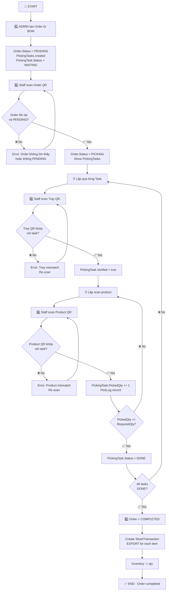

**Key Validations:**
- ✅ Order must exist & be PENDING/PICKING
- ✅ Tray must match PickingTask.TrayID
- ✅ Product must match PickingTask.ProductID
- ✅ PickedQty must be tracked per scan

**Automatic Records:**
- PickLog: Mỗi scan product
- StockTransaction: Khi order COMPLETED

---

## 1.2 🚚 IMPORT PROCESS - Chi tiết từng bước

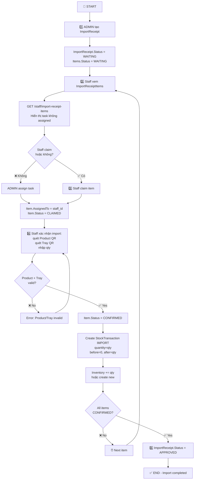

**Status Flow:**
```
ImportReceipt: WAITING → PENDING → APPROVED
Item: WAITING → CLAIMED → CONFIRMED → APPROVED
```

**Alternative: PutawayRequest:**
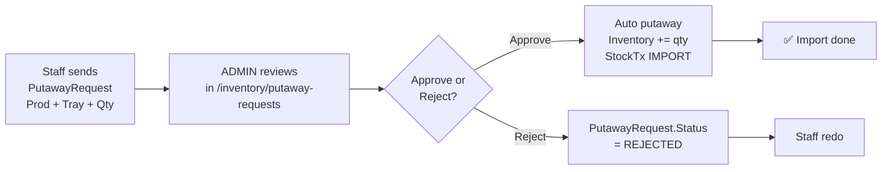

---

## 1.3 📦 STOCK TAKING PROCESS - Chi tiết từng bước

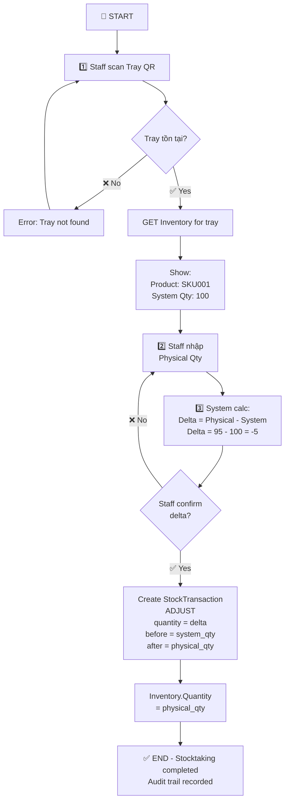

**Delta Analysis:**
- Δ < 0: Hàng thiếu (mất/hỏng/sai tính)
- Δ = 0: Khớp perfect
- Δ > 0: Hàng thừa (có thể tính sai trước)

---

## 1.4 🔧 INVENTORY ADJUSTMENT PROCESS

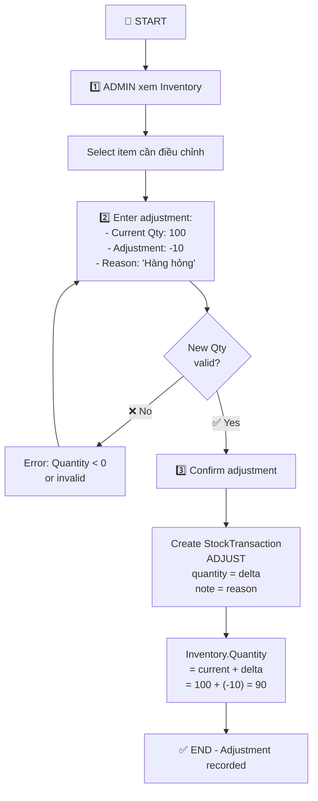

---

## 1.5 👥 STAFF PERFORMANCE REPORTING PROCESS

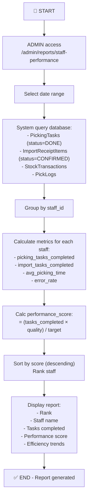

**Metrics Example:**
```
Staff: Nguyễn Văn A
- Picking Tasks Completed: 120
- Import Tasks Completed: 45
- Avg Picking Time: 2.3 min/task
- Error Rate: 2%
- Performance Score: 95/100
- Trend: ↗️ Improving
```

---

## 1.6 📋 ORDER ASSIGNMENT PROCESS

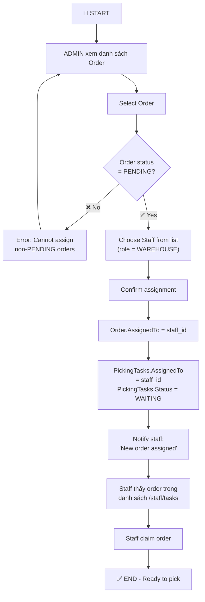

---

# 2. SYSTEM ARCHITECTURE

## 2.1 🏗️ Backend Architecture

```mermaid
graph TB
    Client["🖥️ Frontend / PDA"]
    
    subgraph API["📡 API Layer"]
        Routes["Routes<br/>- /products<br/>- /inventory<br/>- /orders<br/>- /import-receipts<br/>- /staff<br/>- /users"]
        
        Handlers["Handlers<br/>- AuthHandler<br/>- ProductHandler<br/>- InventoryHandler<br/>- OrderHandler<br/>- ImportHandler<br/>- StaffHandler"]
        
        Middleware["Middleware<br/>- AuthRequired<br/>- RequireRoles<br/>- ErrorHandler"]
    end
    
    subgraph Business["🧠 Business Logic Layer"]
        Services["Services<br/>- AuthService<br/>- ProductService<br/>- InventoryService<br/>- OrderService<br/>- ImportService<br/>- StaffService"]
        
        Models["Domain Models<br/>- Product<br/>- Inventory<br/>- Order<br/>- PickingTask<br/>- ImportReceipt<br/>- StockTransaction"]
    end
    
    subgraph Data["💾 Data Layer"]
        Repos["Repositories<br/>- ProductRepo<br/>- InventoryRepo<br/>- OrderRepo<br/>- ImportRepo<br/>- StockTxRepo"]
        
        DB["PostgreSQL Database<br/>- products<br/>- inventory<br/>- orders<br/>- picking_tasks<br/>- import_receipts<br/>- stock_transactions<br/>- users"]
    end
    
    subgraph RealTime["⚡ Real-time"]
        WS["WebSocket Hub<br/>- Client connections<br/>- Event broadcasting"]
        Events["Events<br/>- TaskCreated<br/>- TaskCompleted<br/>- InventoryUpdated"]
    end
    
    Client -->|HTTP + JWT| API
    API -->|call| Business
    Business -->|query/insert| Data
    Business -->|broadcast| RealTime
    RealTime -->|send events| Client
    
    style API fill:#e1f5ff
    style Business fill:#f3e5f5
    style Data fill:#e8f5e9
    style RealTime fill:#fff3e0
```

## 2.2 🔐 Authentication Flow

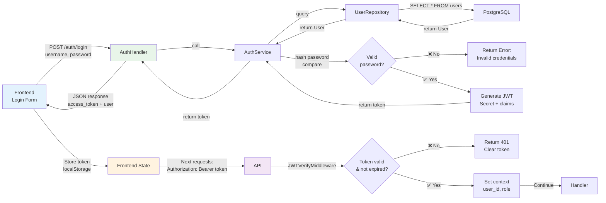

---

# 3. DATA FLOW DIAGRAMS

## 3.1 📥 Picking Data Flow

```mermaid
graph TD
    Start["START: Create Order"] --> OrderData["Order Data<br/>- order_code<br/>- customer_name<br/>- status=PENDING"]
    
    OrderData --> BOMData["BOM Data<br/>- bom_id<br/>- items[]"]
    
    BOMData --> CreateTasks["Create PickingTasks"]
    CreateTasks --> TaskData["PickingTask Data<br/>- order_id<br/>- product_id<br/>- tray_id<br/>- required_qty<br/>- status=WAITING"]
    
    TaskData --> ScanOrder["Staff scan Order QR"]
    ScanOrder --> UpdateStatus1["Order.Status<br/>= PICKING"]
    
    UpdateStatus1 --> ScanTray["Scan Tray QR"]
    ScanTray --> VerifyData["Verify:<br/>Tray matches task"]
    
    VerifyData --> ScanProduct["Scan Product QR"]
    ScanProduct --> LogData["Log Data<br/>- product_id<br/>- tray_id<br/>- qty=1"]
    
    LogData --> UpdateQty["PickingTask<br/>picked_qty += 1"]
    UpdateQty --> CheckDone{"Completed?"}
    
    CheckDone -->|No| ScanProduct
    CheckDone -->|Yes| TaskDone["PickingTask<br/>status = DONE"]
    
    TaskDone --> CreateTx["StockTransaction<br/>- type=EXPORT<br/>- product_id<br/>- tray_id<br/>- qty"]
    
    CreateTx --> UpdateInv["Inventory<br/>quantity -= qty"]
    
    UpdateInv --> AllDone{"All tasks<br/>done?"}
    AllDone -->|No| ScanTray
    AllDone -->|Yes| OrderDone["Order<br/>status = COMPLETED"]
    
    OrderDone --> End["✅ END"]
```

## 3.2 📤 Import Data Flow

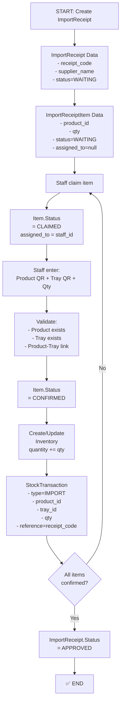

## 3.3 📊 Stock Taking Data Flow

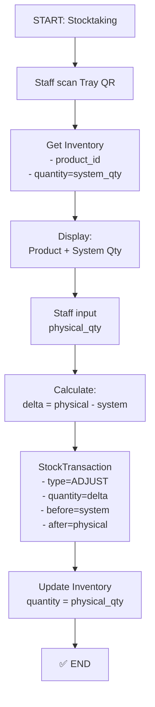

---

# 4. ENTITY RELATIONSHIP DIAGRAM

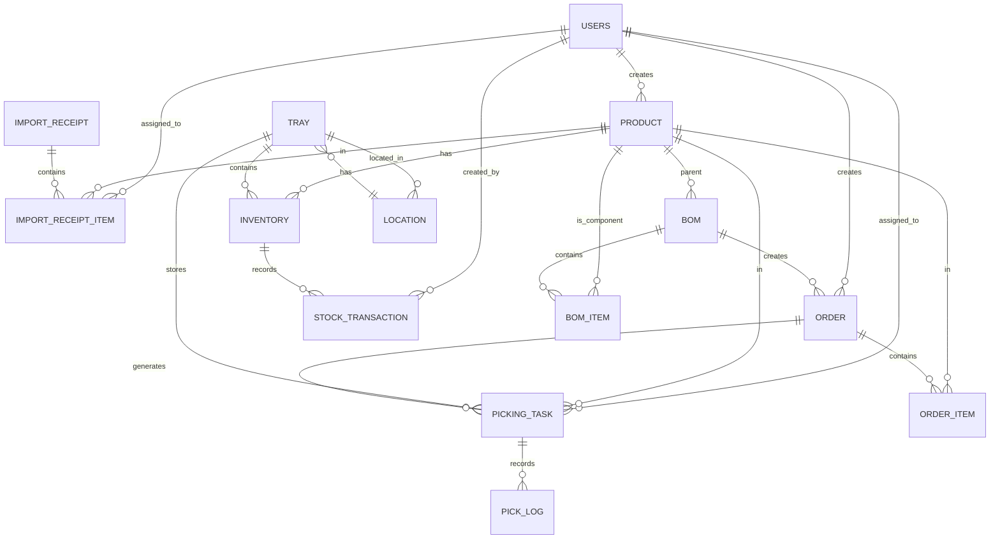

---

# 5. STATE MACHINES

## 5.1 Order State Machine

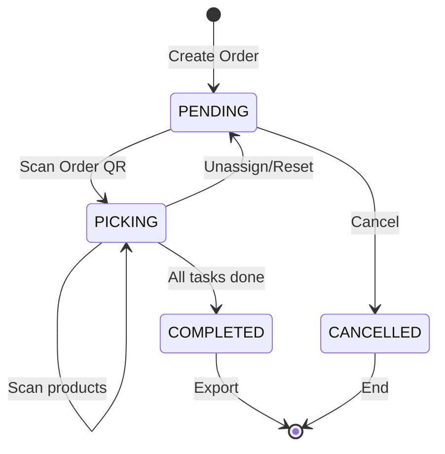

## 5.2 Picking Task State Machine

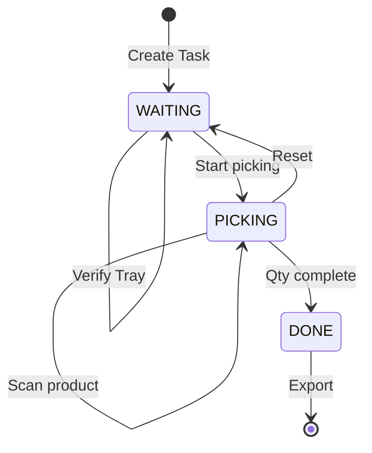

## 5.3 Import Receipt Item State Machine

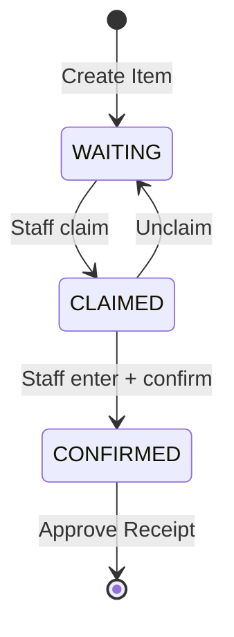

## 5.4 Inventory Status

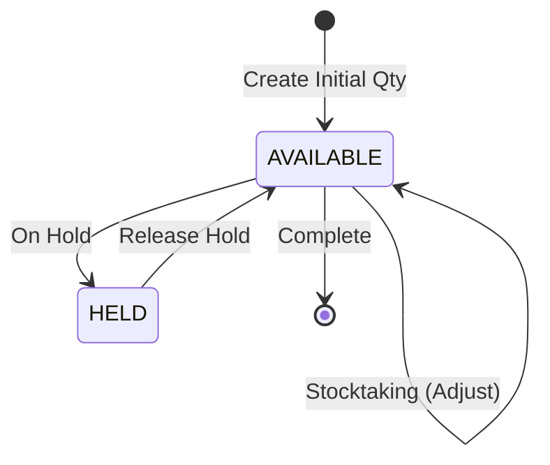

---

# 6. API SEQUENCE DIAGRAMS

## 6.1 Picking Process Sequence

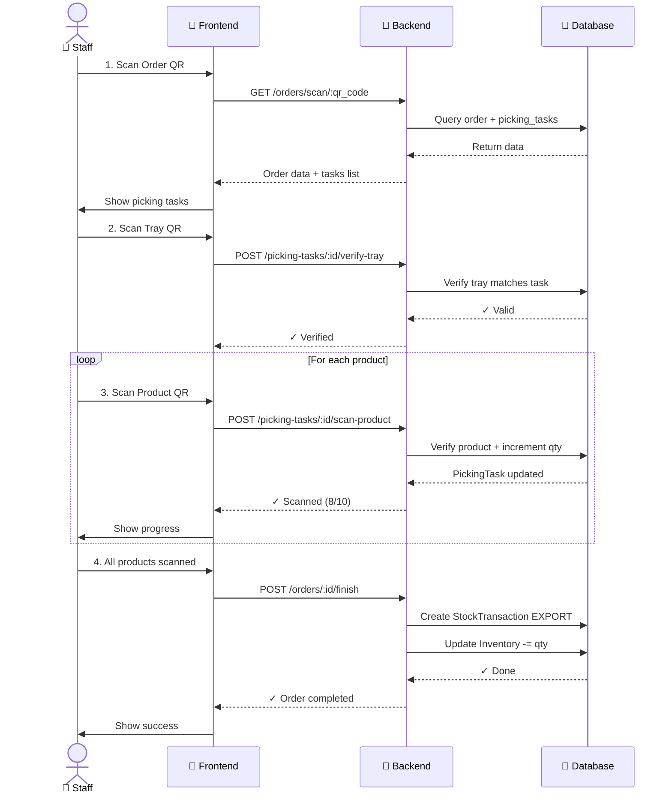

## 6.2 Import Process Sequence

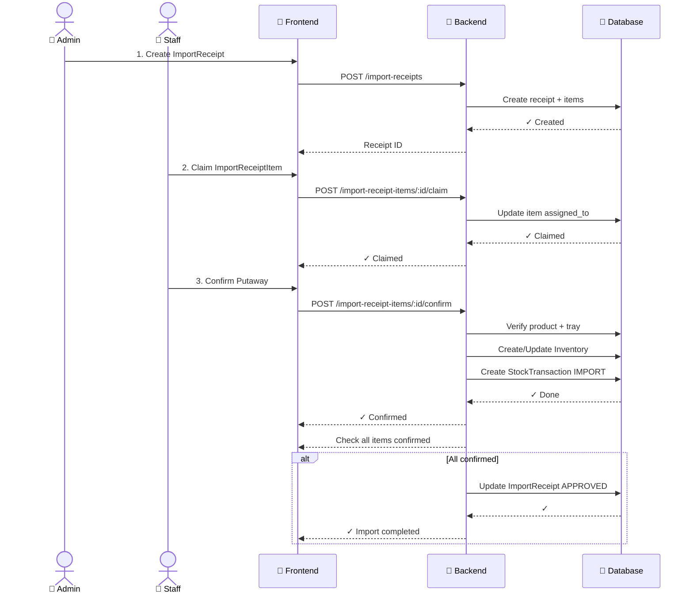

---

# 📋 QUICK REFERENCE

## Status Values

### Order Status
- `PENDING` → `PICKING` → `COMPLETED`
- Special: `CANCELLED`

### PickingTask Status
- `WAITING` → `PICKING` → `DONE`

### ImportReceipt Status
- `WAITING` → `PENDING` → `APPROVED`

### ImportReceiptItem Status
- `WAITING` → `CLAIMED` → `CONFIRMED`

### StockTransaction Type
- `IMPORT`: Nhập kho
- `EXPORT`: Xuất kho (picking)
- `ADJUST`: Điều chỉnh (stocktaking/manual)
- `ROLLBACK`: Hoàn tác (nếu cần)

## Key Validations

✅ **Product-Tray Link**: Tray phải được assign cho Product trước khi import  
✅ **PickingTask Verification**: Phải verify tray trước khi scan product  
✅ **Quantity Matching**: PickedQty phải bằng RequiredQty trước khi task DONE  
✅ **Unique Constraint**: Product Code, Tray Code, Location Code phải unique  
✅ **Inventory Logic**: Không thể negative quantity (ngoài ADJUST case)  

## Transaction Recording

```
PICKING:
  StockTransaction (EXPORT)
  PickLog (audit trail)
  
IMPORT:
  StockTransaction (IMPORT)
  ImportReceiptItem status update
  
STOCKTAKING:
  StockTransaction (ADJUST)
  
ADJUSTMENT:
  StockTransaction (ADJUST)
```

## Performance Metrics

```
PickingTask:
  - Completed tasks / total tasks
  - Average time per task
  - Error rate (incorrect product/tray scans)
  - Peak hours
  
StaffPerformance:
  - Tasks completed (picking + import)
  - Efficiency score
  - Quality metrics (errors)
  - Trend analysis
  
InventoryAccuracy:
  - Stocktaking adjustments
  - Variance %
  - Product-level accuracy
```
